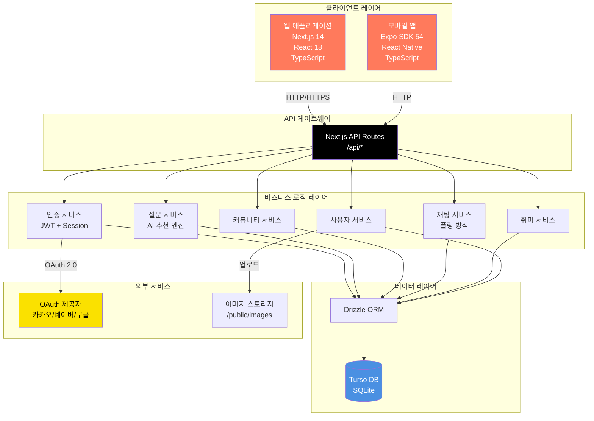
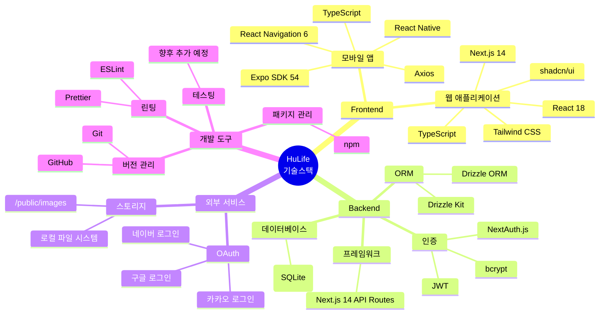
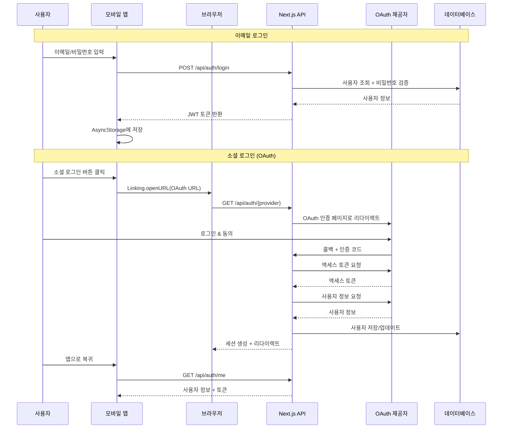
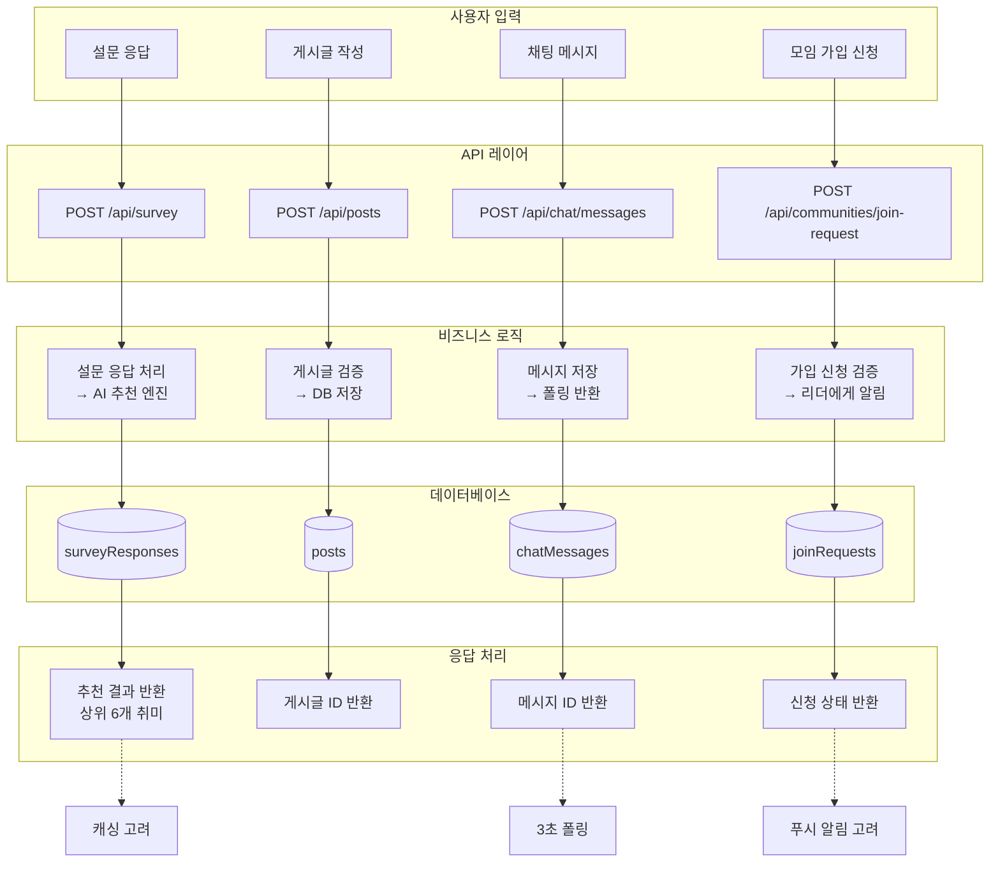
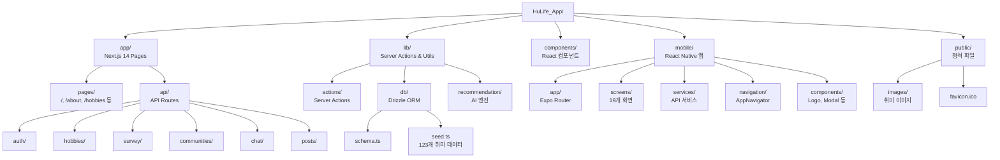
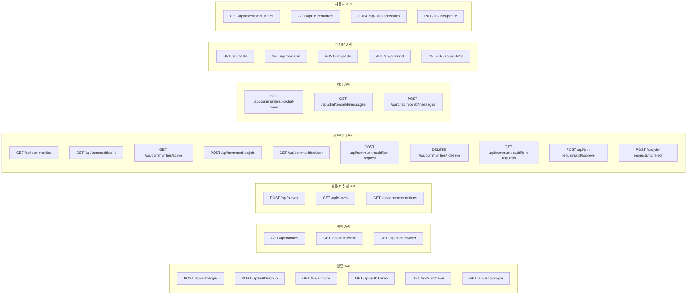
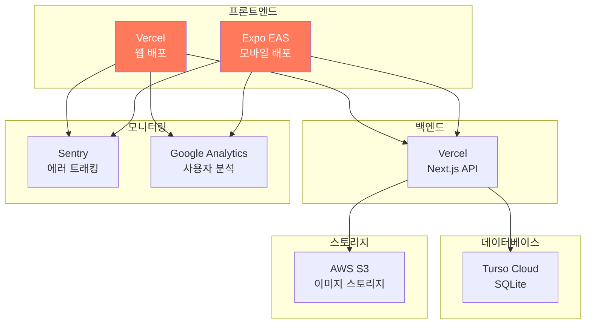
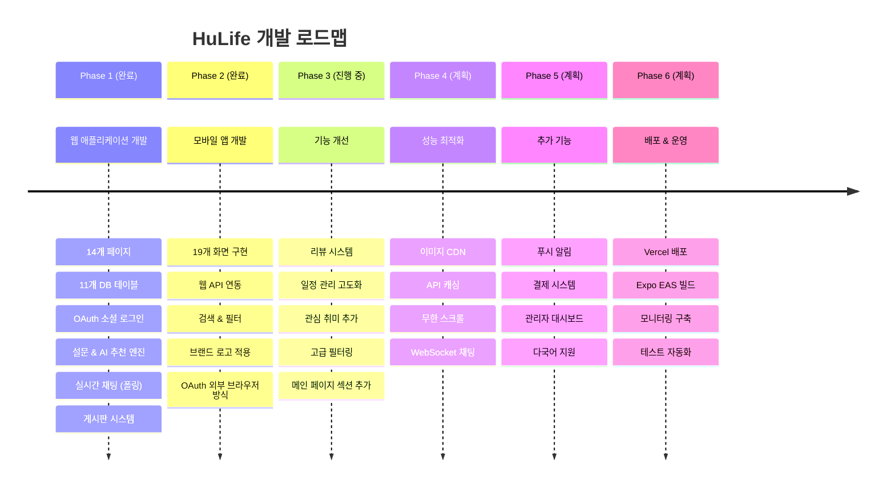
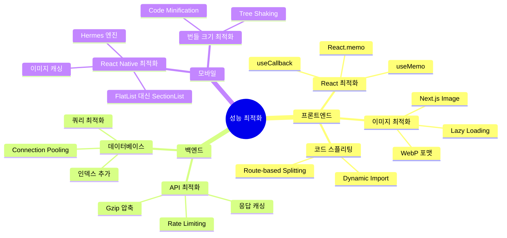
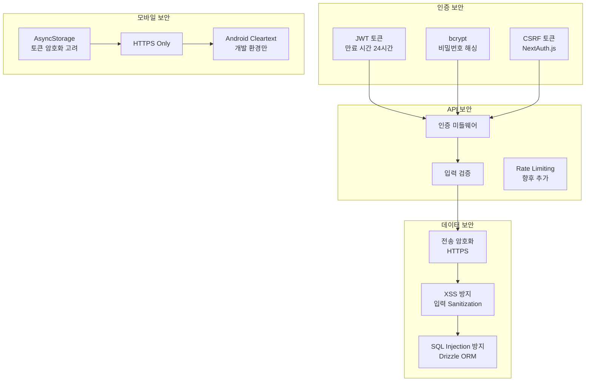

# HuLife 시스템 아키텍처 & 기술스택 로드맵

## 1. 전체 시스템 아키텍처



---

## 2. 기술스택 상세



---

## 3. 웹 애플리케이션 아키텍처

```mermaid
graph LR
    subgraph "웹 프론트엔드"
        Pages[Pages<br/>14개 페이지]
        Components[Components<br/>재사용 컴포넌트]
        Hooks[Custom Hooks]
        Utils[Utils<br/>헬퍼 함수]
    end

    subgraph "Next.js API Routes"
        AuthAPI[/api/auth/*]
        HobbyAPI[/api/hobbies/*]
        SurveyAPI[/api/survey/*]
        CommunityAPI[/api/communities/*]
        ChatAPI[/api/chat/*]
        PostAPI[/api/posts/*]
    end

    subgraph "Server Actions"
        AuthActions[lib/actions/auth.ts]
        HobbyActions[lib/actions/hobbies.ts]
        CommunityActions[lib/actions/community.ts]
        ChatActions[lib/actions/chat.ts]
        PostActions[lib/actions/posts.ts]
    end

    subgraph "데이터베이스"
        Schema[lib/db/schema.ts<br/>Drizzle Schema]
        DBClient[lib/db/index.ts<br/>Turso Client]
    end

    Pages --> Components
    Pages --> Hooks
    Pages --> AuthActions
    Pages --> HobbyActions
    Pages --> CommunityActions

    AuthAPI --> AuthActions
    HobbyAPI --> HobbyActions
    SurveyAPI --> HobbyActions
    CommunityAPI --> CommunityActions
    ChatAPI --> ChatActions
    PostAPI --> PostActions

    AuthActions --> Schema
    HobbyActions --> Schema
    CommunityActions --> Schema
    ChatActions --> Schema
    PostActions --> Schema

    Schema --> DBClient
```

---

## 4. 모바일 애플리케이션 아키텍처

```mermaid
graph LR
    subgraph "모바일 프론트엔드"
        Screens[Screens<br/>19개 화면]
        Components2[Components<br/>Logo, Modal 등]
        Navigation[Navigation<br/>Stack Navigator]
        Types[Types<br/>TypeScript 타입]
    end

    subgraph "API 서비스"
        ApiClient[services/api.ts<br/>Axios 클라이언트]
        AuthService[authService]
        HobbyService[hobbyService]
        CommunityService[communityService]
        ChatService[chatService]
        PostService[postService]
        SurveyService[surveyService]
    end

    subgraph "로컬 스토리지"
        AsyncStorage[AsyncStorage<br/>인증 토큰 저장]
    end

    subgraph "Next.js 서버"
        ServerAPI[/api/*<br/>14개 엔드포인트]
    end

    Screens --> Navigation
    Screens --> Components2
    Screens --> Types

    Screens --> AuthService
    Screens --> HobbyService
    Screens --> CommunityService
    Screens --> ChatService
    Screens --> PostService
    Screens --> SurveyService

    AuthService --> ApiClient
    HobbyService --> ApiClient
    CommunityService --> ApiClient
    ChatService --> ApiClient
    PostService --> ApiClient
    SurveyService --> ApiClient

    ApiClient --> AsyncStorage
    ApiClient -->|HTTP| ServerAPI
```

---

## 5. 인증 흐름 아키텍처



---

## 6. 데이터 흐름 아키텍처



---

## 7. 프로젝트 폴더 구조



---

## 8. 기술 스택 버전 정보

| 카테고리 | 기술 | 버전 | 용도 |
|---------|------|------|------|
| **프레임워크** | Next.js | 14.x | 웹 풀스택 프레임워크 |
| | React | 18.x | UI 라이브러리 |
| | Expo | SDK 54 | React Native 개발 도구 |
| | React Native | 0.76.x | 모바일 크로스 플랫폼 |
| **언어** | TypeScript | 5.x | 정적 타입 언어 |
| | JavaScript | ES2022 | 동적 언어 |
| **스타일링** | Tailwind CSS | 3.x | 유틸리티 CSS 프레임워크 |
| | shadcn/ui | latest | React 컴포넌트 라이브러리 |
| **데이터베이스** | Turso | latest | SQLite 호스팅 서비스 |
| | Drizzle ORM | 0.28.x | TypeScript ORM |
| **인증** | NextAuth.js | 4.x | 인증 라이브러리 |
| | bcrypt | 5.x | 비밀번호 해싱 |
| **HTTP 클라이언트** | Axios | 1.x | HTTP 요청 라이브러리 |
| **네비게이션** | React Navigation | 6.x | 모바일 네비게이션 |
| **스토리지** | AsyncStorage | 1.x | 모바일 로컬 스토리지 |
| **개발 도구** | ESLint | 8.x | 린팅 도구 |
| | Prettier | 3.x | 코드 포맷터 |
| | Git | 2.x | 버전 관리 |

---

## 9. API 엔드포인트 맵



---

## 10. 배포 아키텍처 (향후 계획)



---

## 11. 개발 로드맵



---

## 12. 성능 최적화 전략



---

## 13. 보안 아키텍처



---

## 다이어그램 렌더링 방법

### 1. GitHub에서 보기
- 이 파일을 GitHub에 푸시하면 자동으로 다이어그램이 렌더링됩니다.

### 2. VSCode에서 보기
- **Mermaid Preview** 확장 프로그램 설치
- `Ctrl+Shift+P` → "Mermaid: Preview" 선택

### 3. 온라인 에디터
- [Mermaid Live Editor](https://mermaid.live)에 코드 복사/붙여넣기
- PNG, SVG, PDF로 내보내기 가능

### 4. 프레젠테이션 도구
- [Marp](https://marp.app) - 마크다운 기반 프레젠테이션
- [reveal.js](https://revealjs.com) - HTML 프레젠테이션

---

## 참고 자료

- [Next.js 공식 문서](https://nextjs.org/docs)
- [React Native 공식 문서](https://reactnative.dev/docs/getting-started)
- [Expo 공식 문서](https://docs.expo.dev)
- [Drizzle ORM 공식 문서](https://orm.drizzle.team/docs/overview)
- [Turso 공식 문서](https://docs.turso.tech)
- [Mermaid 공식 문서](https://mermaid.js.org/intro/)

---

**문서 작성일**: 2025-10-16
**최종 수정일**: 2025-10-16
**버전**: 1.0
