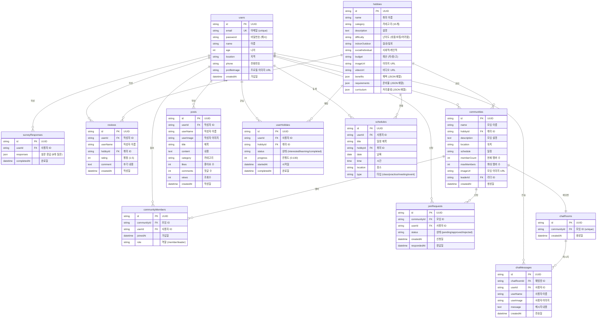

# HuLife 데이터베이스 ERD (Entity Relationship Diagram)

## 전체 ERD (11개 테이블)



---

## 테이블별 상세 설명

### 1. users (사용자)
**용도**: 회원 정보 저장

**주요 컬럼**:
- `id`: UUID 기본키
- `email`: 로그인용 이메일 (unique 제약)
- `password`: bcrypt 해시 비밀번호
- `profileImage`: 프로필 이미지 URL (업로드 시)

**관계**:
- 1명의 사용자 → N개의 설문 응답
- 1명의 사용자 → N개의 리뷰 작성
- 1명의 사용자 → N개의 모임 참여
- 1명의 사용자 → N개의 관심 취미

---

### 2. hobbies (취미)
**용도**: 취미 카탈로그 (123개 데이터)

**주요 컬럼**:
- `category`: 15개 카테고리 (운동/스포츠, 예술/창작, 음악/악기 등)
- `difficulty`: 난이도 (쉬움, 보통, 어려움)
- `indoorOutdoor`: 실내/실외 구분
- `socialIndividual`: 사회적/개인적 구분
- `budget`: 예산 수준 (저/중/고)
- `benefits`: JSON 배열 (["스트레스 해소", "체력 향상"] 등)
- `requirements`: JSON 배열 (["요가 매트", "운동복"] 등)
- `curriculum`: JSON 배열 (주차별 학습 내용)

**관계**:
- 1개 취미 → N개의 리뷰
- 1개 취미 → N개의 모임
- 1개 취미 → N명의 관심 사용자

---

### 3. surveyResponses (설문 응답)
**용도**: 사용자 취미 추천 설문 응답 저장

**주요 컬럼**:
- `userId`: 응답자 (users 테이블 FK)
- `responses`: JSON 객체
  ```json
  {
    "1": 4,  // 질문 1: 야외 활동 선호도 (1-5)
    "2": 5,  // 질문 2: 자연 선호도
    ...
    "8": 3   // 질문 8: 예산 수준
  }
  ```
- `completedAt`: 설문 완료 시각

**관계**:
- 1명의 사용자 → 최대 1개의 설문 응답 (최신 응답 우선)

---

### 4. reviews (리뷰)
**용도**: 취미 후기 및 평가

**주요 컬럼**:
- `userId`: 작성자 (users 테이블 FK)
- `hobbyId`: 리뷰 대상 취미 (hobbies 테이블 FK)
- `rating`: 별점 (1-5)
- `comment`: 후기 내용 (텍스트)

**관계**:
- 1개 취미 → N개의 리뷰
- 1명의 사용자 → N개의 리뷰 작성

---

### 5. communities (모임/커뮤니티)
**용도**: 취미별 오프라인/온라인 모임

**주요 컬럼**:
- `hobbyId`: 모임의 주제 취미 (hobbies 테이블 FK)
- `leaderId`: 모임 리더 (users 테이블 FK)
- `memberCount`: 현재 멤버 수 (동적 업데이트)
- `maxMembers`: 정원 제한
- `location`: 모임 장소 (예: "서울 강남구")
- `schedule`: 모임 일정 (예: "매주 토요일 오후 2시")

**관계**:
- 1개 모임 → 1명의 리더
- 1개 모임 → N명의 멤버
- 1개 취미 → N개의 모임

---

### 6. communityMembers (모임 멤버)
**용도**: 모임-사용자 다대다 관계 (중간 테이블)

**주요 컬럼**:
- `communityId`: 모임 ID (communities 테이블 FK)
- `userId`: 사용자 ID (users 테이블 FK)
- `role`: 역할 (member 또는 leader)
- `joinedAt`: 가입 시각

**관계**:
- N명의 사용자 ↔ M개의 모임 (다대다)

---

### 7. joinRequests (가입 신청)
**용도**: 모임 가입 신청 및 승인/거절 관리

**주요 컬럼**:
- `communityId`: 신청한 모임 (communities 테이블 FK)
- `userId`: 신청자 (users 테이블 FK)
- `status`: 상태
  - `pending`: 승인 대기
  - `approved`: 승인됨
  - `rejected`: 거절됨
- `createdAt`: 신청 시각
- `respondedAt`: 리더가 응답한 시각

**관계**:
- 1개 모임 → N개의 가입 신청
- 1명의 사용자 → N개의 가입 신청 (다른 모임)

---

### 8. posts (게시글)
**용도**: 커뮤니티 게시판 게시글

**주요 컬럼**:
- `userId`: 작성자 (users 테이블 FK)
- `userName`, `userImage`: 작성자 정보 (비정규화)
- `category`: 카테고리 (자유게시판, 질문/답변, 정보공유)
- `likes`: 좋아요 수 (동적 업데이트)
- `comments`: 댓글 수 (동적 업데이트)
- `views`: 조회수 (동적 업데이트)

**관계**:
- 1명의 사용자 → N개의 게시글 작성

**주의**: 현재는 전체 게시판 (communityId FK 없음). 향후 커뮤니티별 게시판으로 확장 가능.

---

### 9. userHobbies (사용자-취미 관계)
**용도**: 사용자의 관심 취미 및 학습 진행 상태

**주요 컬럼**:
- `userId`: 사용자 (users 테이블 FK)
- `hobbyId`: 취미 (hobbies 테이블 FK)
- `status`: 상태
  - `interested`: 관심 있음
  - `learning`: 학습 중
  - `completed`: 완료
- `progress`: 진행도 (0-100%)
- `startedAt`: 학습 시작일 (learning으로 변경 시)
- `completedAt`: 완료일 (completed로 변경 시)

**관계**:
- N명의 사용자 ↔ M개의 취미 (다대다)

---

### 10. schedules (일정)
**용도**: 사용자의 취미 관련 일정 관리

**주요 컬럼**:
- `userId`: 사용자 (users 테이블 FK)
- `hobbyId`: 연결된 취미 (hobbies 테이블 FK, optional)
- `type`: 일정 타입
  - `class`: 수업
  - `practice`: 연습
  - `meeting`: 모임
  - `event`: 행사
- `date`: 날짜 (YYYY-MM-DD)
- `time`: 시간 (HH:MM)
- `location`: 장소

**관계**:
- 1명의 사용자 → N개의 일정

---

### 11. chatRooms (채팅방)
**용도**: 커뮤니티별 채팅방 (1:1 매핑)

**주요 컬럼**:
- `communityId`: 모임 ID (communities 테이블 FK, unique)

**관계**:
- 1개 모임 → 1개 채팅방 (1:1)
- 1개 채팅방 → N개의 메시지

---

### 12. chatMessages (채팅 메시지)
**용도**: 실시간 채팅 메시지 저장

**주요 컬럼**:
- `chatRoomId`: 채팅방 (chatRooms 테이블 FK)
- `userId`: 전송자 (users 테이블 FK)
- `userName`, `userImage`: 전송자 정보 (비정규화)
- `message`: 메시지 내용
- `createdAt`: 전송 시각 (폴링 시 정렬 기준)

**관계**:
- 1개 채팅방 → N개의 메시지
- 1명의 사용자 → N개의 메시지

---

## 주요 비즈니스 로직 흐름

### 1. 회원가입 → 설문 → 추천
```
1. users 테이블에 신규 사용자 삽입
2. surveyResponses 테이블에 설문 응답 저장
3. 설문 응답 기반으로 hobbies 테이블 조회 + 매칭 점수 계산
4. 상위 6개 취미를 추천 결과로 반환
5. 사용자가 "관심 추가" 클릭 시 userHobbies 테이블에 삽입 (status: interested)
```

### 2. 모임 가입 신청 → 승인 → 채팅
```
1. joinRequests 테이블에 삽입 (status: pending)
2. 리더가 승인 클릭 → status를 approved로 업데이트
3. communityMembers 테이블에 삽입 (role: member)
4. communities.memberCount 1 증가
5. chatRooms 테이블에서 해당 모임의 채팅방 조회
6. chatMessages 테이블에서 메시지 목록 조회/전송
```

### 3. 게시글 작성 → 조회수 증가
```
1. posts 테이블에 신규 게시글 삽입 (likes: 0, comments: 0, views: 0)
2. 다른 사용자가 게시글 클릭 시 views += 1
3. 좋아요 클릭 시 likes += 1 (향후 별도 likes 테이블로 확장 가능)
4. 댓글 작성 시 comments += 1 (향후 comments 테이블로 확장 가능)
```

### 4. 일정 등록 → 캘린더 표시
```
1. schedules 테이블에 신규 일정 삽입
2. 마이페이지 일정 탭에서 schedules 조회 (WHERE userId = ?)
3. 캘린더 컴포넌트가 date 기준으로 그룹핑
4. 각 날짜에 일정 개수만큼 색상 점 표시
```

---

## 인덱스 추천

### 성능 최적화를 위한 인덱스

```sql
-- users
CREATE INDEX idx_users_email ON users(email);

-- hobbies
CREATE INDEX idx_hobbies_category ON hobbies(category);
CREATE INDEX idx_hobbies_difficulty ON hobbies(difficulty);

-- communities
CREATE INDEX idx_communities_hobbyId ON communities(hobbyId);
CREATE INDEX idx_communities_leaderId ON communities(leaderId);

-- communityMembers
CREATE INDEX idx_communityMembers_communityId ON communityMembers(communityId);
CREATE INDEX idx_communityMembers_userId ON communityMembers(userId);
CREATE UNIQUE INDEX idx_communityMembers_unique ON communityMembers(communityId, userId);

-- joinRequests
CREATE INDEX idx_joinRequests_communityId ON joinRequests(communityId);
CREATE INDEX idx_joinRequests_userId ON joinRequests(userId);
CREATE INDEX idx_joinRequests_status ON joinRequests(status);

-- posts
CREATE INDEX idx_posts_category ON posts(category);
CREATE INDEX idx_posts_createdAt ON posts(createdAt DESC);

-- userHobbies
CREATE INDEX idx_userHobbies_userId ON userHobbies(userId);
CREATE INDEX idx_userHobbies_hobbyId ON userHobbies(hobbyId);
CREATE INDEX idx_userHobbies_status ON userHobbies(status);

-- schedules
CREATE INDEX idx_schedules_userId ON schedules(userId);
CREATE INDEX idx_schedules_date ON schedules(date);

-- chatRooms
CREATE UNIQUE INDEX idx_chatRooms_communityId ON chatRooms(communityId);

-- chatMessages
CREATE INDEX idx_chatMessages_chatRoomId ON chatMessages(chatRoomId);
CREATE INDEX idx_chatMessages_createdAt ON chatMessages(createdAt DESC);
```

---

## 다이어그램 렌더링 방법

### 1. GitHub에서 보기
- 이 파일을 GitHub에 푸시하면 자동으로 ERD가 렌더링됩니다.

### 2. VSCode에서 보기
- **Mermaid Preview** 확장 프로그램 설치
- `Ctrl+Shift+P` → "Mermaid: Preview" 선택

### 3. 온라인 에디터
- [Mermaid Live Editor](https://mermaid.live)에 코드 복사/붙여넣기
- PNG, SVG, PDF로 내보내기 가능

### 4. DB 설계 도구
- [dbdiagram.io](https://dbdiagram.io) - DBML 형식으로 변환 가능
- [draw.io](https://draw.io) - 수동으로 ERD 작성
