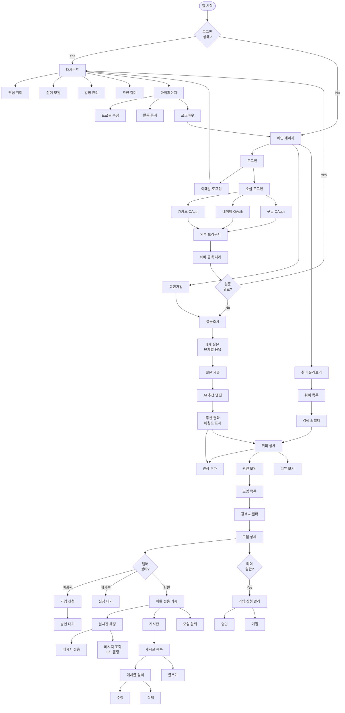
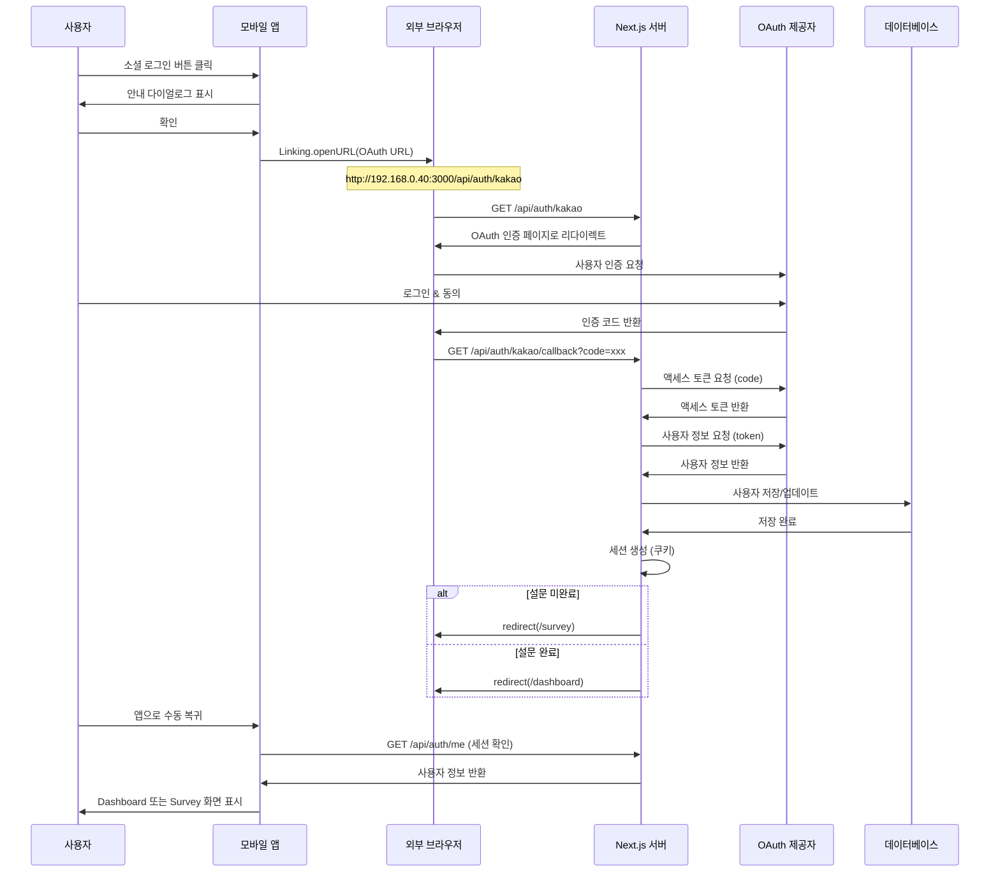
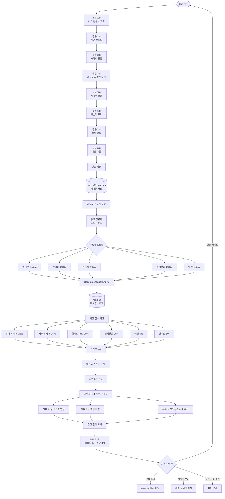
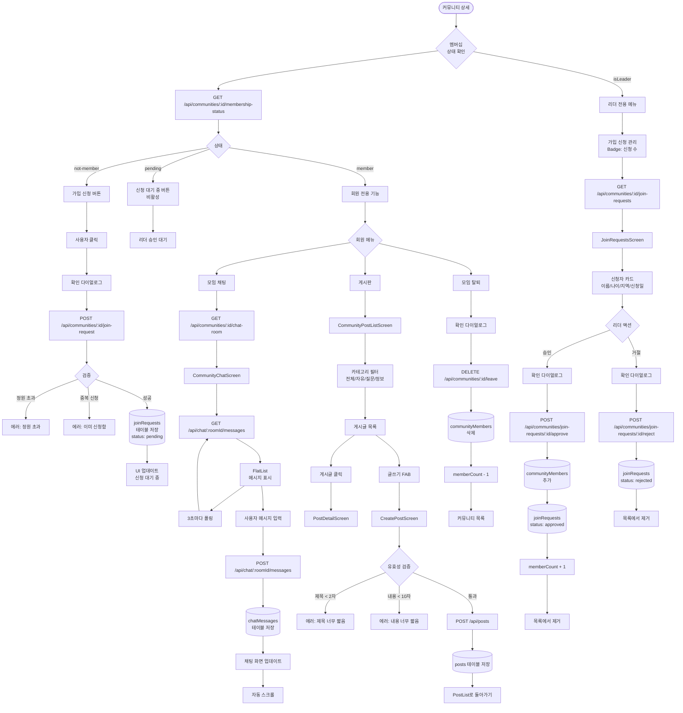
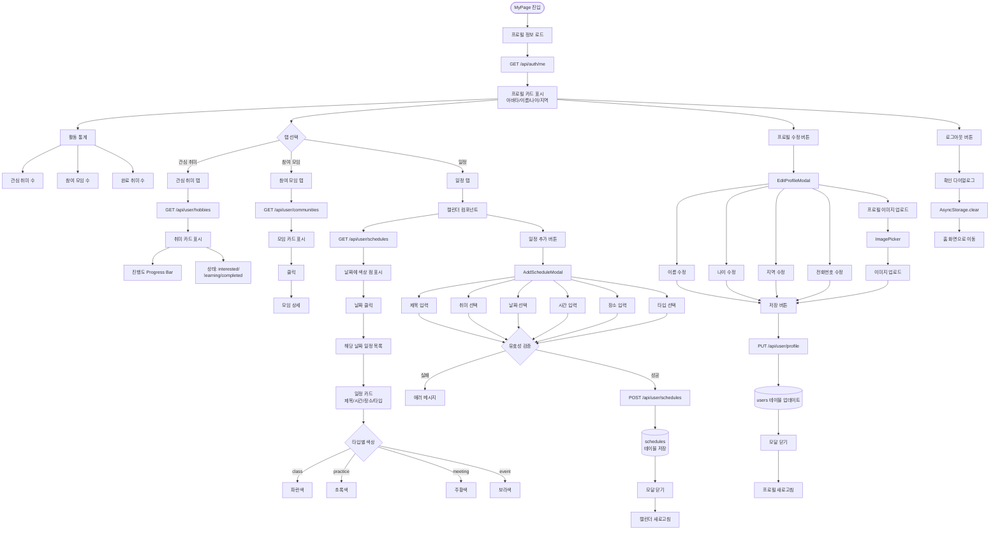

# HuLife 사용자 플로우차트

## 1. 전체 사용자 여정

## 2. OAuth 소셜 로그인 상세 플로우

## 3. 설문 & 추천 시스템 플로우

## 4. 커뮤니티 가입 & 채팅 플로우

## 5. 마이페이지 & 일정 관리 플로우

---

## 다이어그램 렌더링 방법

### 1. GitHub에서 보기
- 이 파일을 GitHub에 푸시하면 자동으로 다이어그램이 렌더링됩니다.

### 2. VSCode에서 보기
- **Mermaid Preview** 확장 프로그램 설치
- `Ctrl+Shift+P` → "Mermaid: Preview" 선택

### 3. 온라인 에디터
- [Mermaid Live Editor](https://mermaid.live)에 코드 복사/붙여넣기
- PNG, SVG, PDF로 내보내기 가능

### 4. 마크다운 뷰어
- Typora, Obsidian 등 Mermaid를 지원하는 마크다운 에디터 사용
